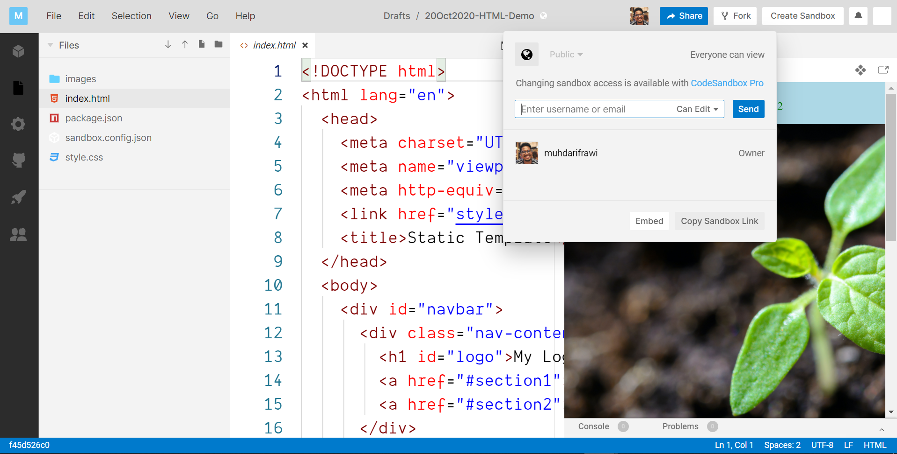
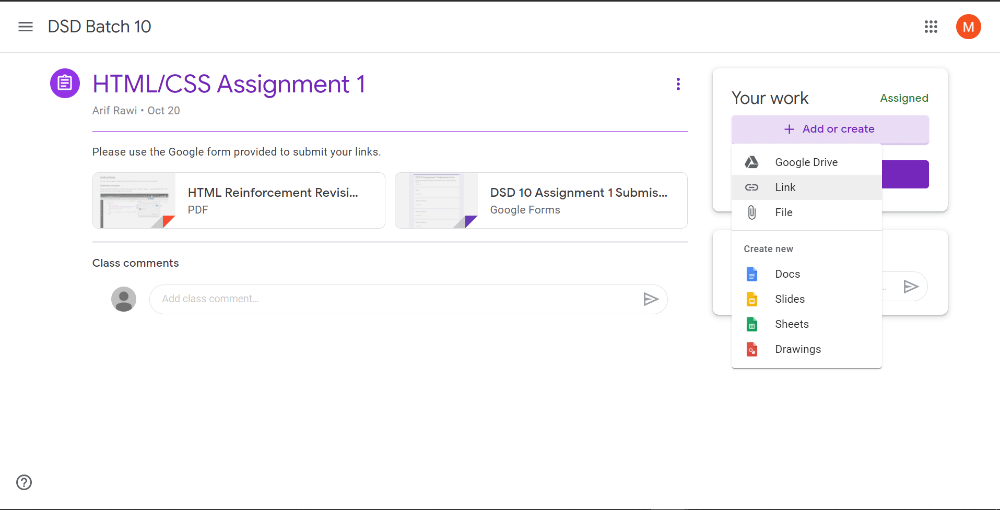
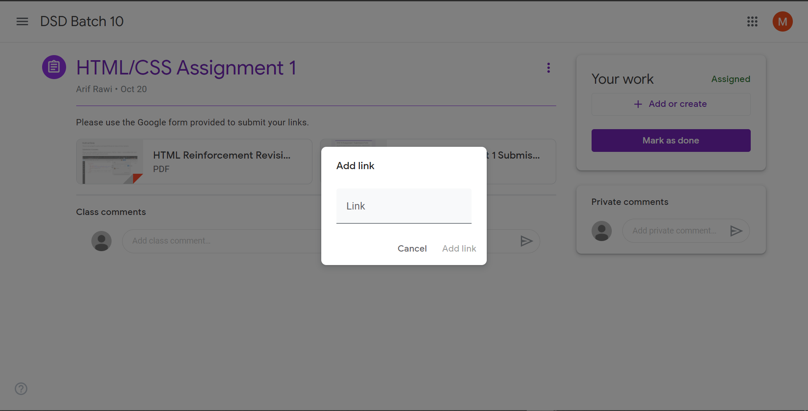
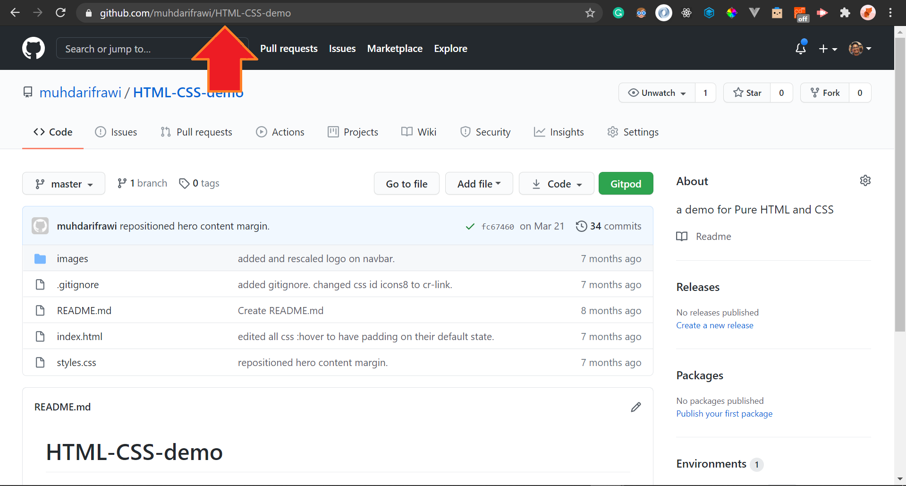
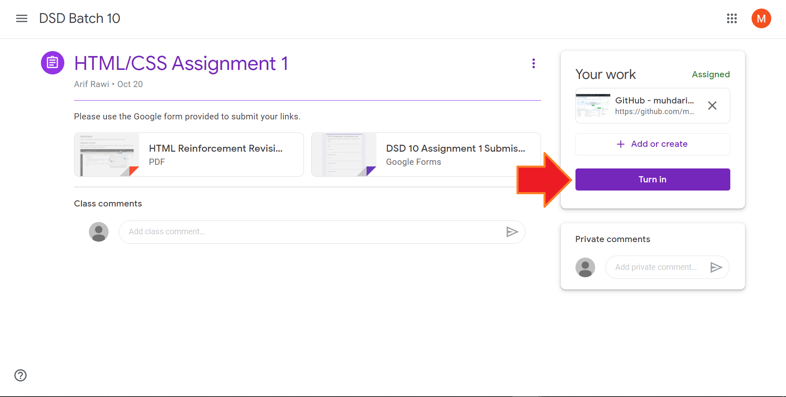
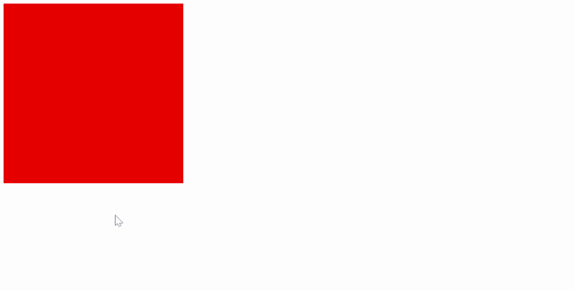
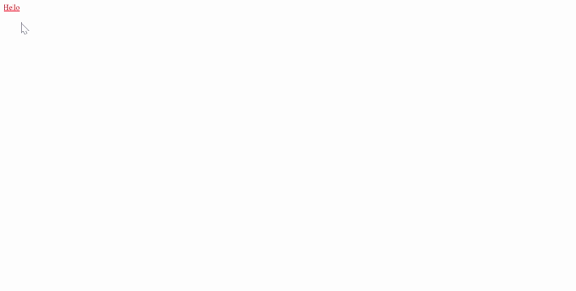
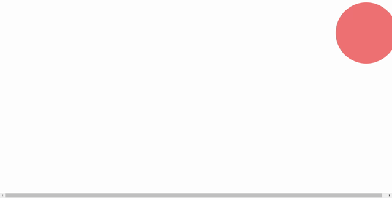

# HTML Reinforcement Revision 3

## Instructions

You are encouraged to read up and research if you are unsure of your answers. 

### Submission of answers

#### Submission via Google Forms

Please use code sandbox to submit your answers. Click on "share > copy sandbox link" and paste the link to the Google form provided.

#### Submission via GitHub

Open up the assignment page and click on the "Add or create" button then select "link".

When the prompt appears, paste in your GitHub repository URL that contains the solutions.

The GitHub repository URL is as shown.

Once you have loaded it successfully, click on the "Turn In" button.

## Contents

[Question 1](#question-1-back-to-contents) 
[Question 1 Preview](#question-1-preview-back-to-contents) 
[Question 2](#question-2-back-to-contents) 
[Question 2 Preview](#question-2-preview-back-to-contents) 
[Question 3](#question-3-back-to-contents) 
[Question 3 Preview](#question-3-preview-back-to-contents) 
[Question 4](#question-4-back-to-contents) 
[Question 4 Preview](#question-4-preview-back-to-contents) 
[Question 5](#question-5-back-to-contents) 
[Question 5 Preview](#question-5-preview-back-to-contents) 

## Question 1 <a style="font-size:8pt;" href="#contents">[back to contents]</a>

Using the **transition property** create a box of size 400px by 400px with a color of your choosing that would change into another color when users hovers their mouse over the box. 

### Question 1 Preview <a style="font-size:8pt;" href="#contents">[back to contents]</a>

## Question 2 <a style="font-size:8pt;" href="#contents">[back to contents]</a>

Create links that do not have the underlines under them. Additionally, they should have different colors when:

1. link has not been clicked
2. hovered over
3. user click and hold the link
4. the link is visited

### Question 2 Preview <a style="font-size:8pt;" href="#contents">[back to contents]</a>

## Question 3 <a style="font-size:8pt;" href="#contents">[back to contents]</a>

Create **media breakpoints** such that the `<body>` would have different backgrounds at the following intervals:

- pink if viewscreen width is smaller than 300px in width
- orange between 300px and 500px in width
- purple if more than 500px

### Question 3 Preview <a style="font-size:8pt;" href="#contents">[back to contents]</a>

## Question 4 <a style="font-size:8pt;" href="#contents">[back to contents]</a>

Create a div that contains 5 boxes with each of size 400px by 400px. 

Using **flexbox properties**, make it such a way that the boxes would remain in shape no matter the viewscreen width. 

Additionally, the boxes should not be touching each other and that they should stay in the center of the width of the viewscreen as much as possible.

### Question 4 Preview <a style="font-size:8pt;" href="#contents">[back to contents]</a>

## Question 5 <a style="font-size:8pt;" href="#contents">[back to contents]</a>

Create a ball shaped `
` with a color of your choosing. From there, create an animation such that:

1. the ball would start on the right side of the screen 
2. then moves to the left side of the screen
3. then moves to the bottom left side of the screen
4. and finally ends where it started

### Question 5 Preview <a style="font-size:8pt;" href="#contents">[back to contents]</a>

